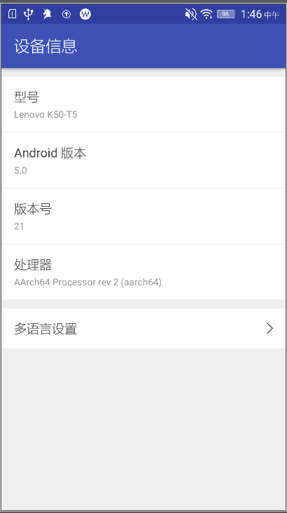
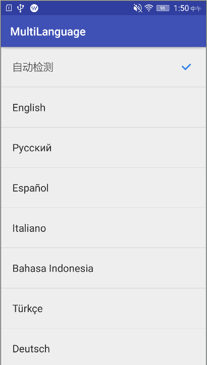

# MultiLanguage
Android多语言更换。

# 效果图

目前项目中，只放置了中文和默认文案。如有需要，可自行添加其他语言。此项目作为Demo学习参考。有好的想法，欢迎一起探讨~

# 博客
Android多语言及字体大小的设置：<http://xyzlf.github.io/2017/03/08/android-resource.html>

# 关于我
有任何使用问题，可以给我发邮件：

Author：张利峰

E-mail：519578280@qq.com

# License

    Copyright(c)2017 xyzlf Open Source Project
    
    Licensed under the Apache License, Version 2.0 (the "License");
    you may not use this file except in compliance with the License.
    You may obtain a copy of the License at
    
    http://www.apache.org/licenses/LICENSE-2.0
    
    Unless required by applicable law or agreed to in writing, software
    distributed under the License is distributed on an "AS IS" BASIS,
    WITHOUT WARRANTIES OR CONDITIONS OF ANY KIND, either express or implied.
    See the License for the specific language governing permissions and
    limitations under the License.